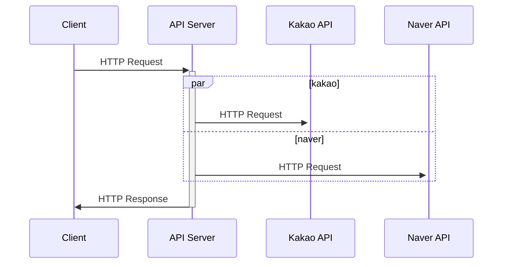
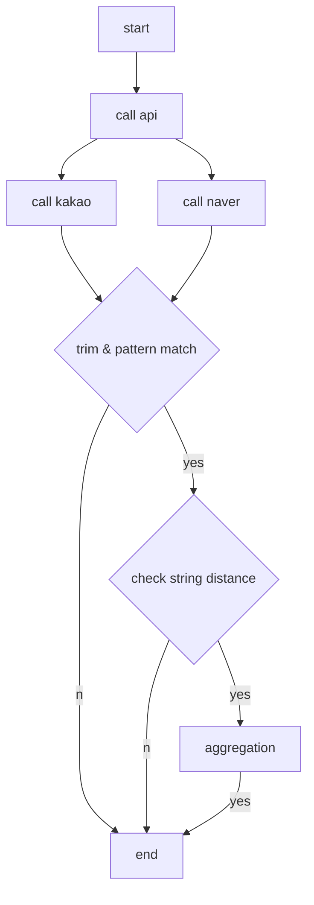
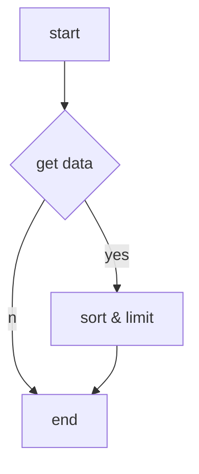

# study-localsearch-api

---

## 기술

- Java 8
- Spring Boot 2.6.3
- Gradle 7.4
- H2(in-memory) DB


### 사용 라이브러리 & 사용 목적

- spring-boot-starter-web
  - 스프링 MVC 구성
- spring-boot-starter-actuator
  - 서버 메트릭 엔드포인트 구성
- spring-boot-devtools
  - 스프링 개발환경 구성
- spring-boot-starter-test
  - junit 테스트 작성
- spring-boot-starter-data-jpa
  - ORM 이용 DB 접근
- spring-boot-starter-webflux
  - WebClient Non-blocking 호출
- spring-boot-starter-validation
  - 모델 검증
- spring-boot-starter-aop
  - Aspect 공통 로직 구성
- projectlombok
  - 보일러플레이트를 줄이기 위한 애너테이션 사용
- h2database
  - 로컬환경 H2 인메모리 DB 구성

---

## API 목록

### 1) 장소 검색

**`GET) /api/v1/places?query={query}`**

#### 호출 예시

```sh
$ curl http://localhost:8080/api/v1/places?query=%EA%B0%88%EB%B9%84
```

#### Request

| 메서드 | URL            | 출력             |
| ------ | -------------- | ---------------- |
| GET    | /api/v1/places | application/json |

##### Query Params

| KEY   | DESC                    |
| ----- | ----------------------- |
| query | 검색어 (UTF-8 Encoding) |


#### Response

##### Message

| NAME    | TYPE   | DESC             |
| ------- | ------ | ---------------- |
| code    | String | HTTP 응답 코드   |
| message | String | HTTP 응답 메시지 |
| result  | Object | 응답 결과        |

##### Place

| NAME        | TYPE   | DESC          |
| ----------- | ------ | ------------- |
| name        | String | 장소명        |
| url         | String | 홈페이지 주소 |
| category    | String | 장소 분류     |
| phone       | String | 연락처        |
| address     | String | 동 주소       |
| roadAddress | String | 도로명 주소   |

```json
{
    "code": "200",
    "message": "OK",
    "result": {
        "places": [
            {
                "name": "식당A",
                "url": "http://place.map.kakao.com/1234567",
                "category": "음식점 > 한식 > 소분류",
                "phone": "012-345-6789",
                "address": "강원 공공시 공공동 123",
                "roadAddress": "강원 공공시 공공공마을길 12"
            },
          	...
        ]
    }
}
```


#### 호출 흐름




**논리 흐름**




### 2) 검색 키워드 목록

**`GET) /api/v1/trends`**

#### 호출 예시

```sh
$ curl http://localhost:8080/api/v1/trends
```

#### Request

| 메서드 | URL            | 출력             |
| ------ | -------------- | ---------------- |
| GET    | /api/v1/trends | application/json |


#### Response

##### Message

| NAME    | TYPE   | DESC             |
| ------- | ------ | ---------------- |
| code    | String | HTTP 응답 코드   |
| message | String | HTTP 응답 메시지 |
| result  | Object | 응답 결과        |

##### Trend

| NAME    | TYPE   | DESC      |
| ------- | ------ | --------- |
| keyword | String | 검색어    |
| count   | Long   | 검색 횟수 |

```json
{
    "code": "200",
    "message": "OK",
    "result": {
        "trends": [
            {
                "keyword": "곱창",
                "count": 10
            },
          	...
        ]
    }
}
```


**논리 흐름**




---

## 기술적 요구사항

### 동시성 이슈가 발생할 수 있는 부분

```java
@Transactional
private void updateKeyword(String query) {
	SearchHistoryInfo item = searchHistoryRepository.findOneByKeyword(query);
    //...
	SearchHistoryInfo update = SearchHistoryInfo.builder()
			.keyword(item.getKeyword())
			.count(item.getCount()+1)
			.build();
	update = searchHistoryRepository.save(update);
}
```

검색 API 호출시 search_history 테이블의 count를 1씩 증가합니다.

여러 쓰레드에 대한 공유 자원이므로 동시성 이슈를 고려합니다.

```java
@Repository
public interface SearchHistoryRepository extends JpaRepository<SearchHistoryInfo, String> {
	@Lock(value = LockModeType.PESSIMISTIC_WRITE)
	@QueryHints({@QueryHint(name = "javax.persistence.lock.timeout", value ="1000")})
	SearchHistoryInfo findOneByKeyword(String keyword);
  //...
}
```

`	@Lock(value = LockModeType.PESSIMISTIC_WRITE)`

Read 오퍼레이션에 대하여 비관적 락을 명시하여 해당 행에 대하여 배타적으로 락을 걸었습니다.


**동시성 테스트**

```java
@Test
public void isConcurrencyTestSuccess() throws InterruptedException {
	CountDownLatch latch = new CountDownLatch(nThreads);
	String query = "test";
	SearchHistoryInfo item = searchHistoryRepository.save(SearchHistoryInfo.builder()
			.keyword(query)
			.count(0L)
			.build());
	
	for(int i=0; i<nThreads; i++) {
		service.execute(() -> {
			item.setCount(item.getCount()+1);
			latch.countDown();
		});
	}
	
	latch.await();
	
	SearchHistoryInfo result = searchHistoryRepository.findOneByKeyword(query);
	log.info("success concurrency threads, count: {}, {}", nThreads, result.getCount());
	
	assertTrue(result.getCount() == nThreads);
}

@Test
public void isConcurrencyTestFail() throws InterruptedException {
	//...
	
	SearchHistoryInfo result = searchHistoryRepository.findOneByKeywordOrderByKeyword(query);
	log.info("fail concurrency threads, count: {}, {}", nThreads, result.getCount());
	
	assertTrue(result.getCount() != nThreads);
}
```

> nThreads = 2000

**실행 결과**

```java
2022-02-17 22:17:54.802  INFO 3113 --- [           main] c.a.r.SearchHistoryRepositoryTests       : success concurrency threads, count: 2000, 2000
2022-02-17 22:17:54.841  INFO 3113 --- [           main] c.a.r.SearchHistoryRepositoryTests       : fail concurrency threads, count: 2000, 1927
```


### 장애 발생 상황 고려

```java
@Slf4j
@RestControllerAdvice
public class RestExceptionHandler {
	
	@Autowired
	MessageSource messageSource;
	
	/**
	 * 400 예외 처리
	 * HTTP STATUS: 400 BAD REQUEST
	 */
	@ExceptionHandler(BindException.class)
	@ResponseStatus(HttpStatus.BAD_REQUEST)
	public GenericMessage error400(BindException ex) {
	 	//...
	}

	/**
	 * 404 예외 처리 
	 * HTTP STATUS: 404 NOT FOUND
	 */
	@ExceptionHandler(NoHandlerFoundException.class)
	@ResponseStatus(HttpStatus.NOT_FOUND)
	public GenericMessage error404(NoHandlerFoundException ex) {
		//...
	}
	
	/**
	 * 405 예외 처리
	 * HTTP STATUS: 405 METHOD NOT ALLOWED
	 */
	@ExceptionHandler(HttpRequestMethodNotSupportedException.class)
	@ResponseStatus(HttpStatus.METHOD_NOT_ALLOWED)
	public GenericMessage error405(HttpRequestMethodNotSupportedException ex) {
		//...
	}
	
	/**
	 * 기본 예외 처리
	 * HTTP STATUS: 500 INTERNAL SERVER ERROR
	 */
	@ExceptionHandler(Exception.class)
	@ResponseStatus(HttpStatus.INTERNAL_SERVER_ERROR)
	public GenericMessage error500(Exception ex) {
		//...
	}
}
```

컨트롤러단의 예외를 처리하는 `@RestControllerAdvice`를 이용하였습니다.

대표적인 HTTP STATUS에 대한 예외 처리를 해주었으며 그 외 서버 내 연동(ex 연동 API 호출)에 대하여는 500 에러로 처리하였습니다.

```properties
validation.not-null=%s(은)는 필수값입니다.

error.method-not-allowed={0} 메서드는 지원하지 않습니다.
error.not-found={0} 주소를 찾을 수 없습니다.
error.internal-server-error= 내부 서버 오류
```

MessageSource를 사용하여 검증과 예외처리 메시지를 `messagers.properties` 에 정의하였습니다.


**예외 처리 응답 예시**

```json
{
    "code": "400",
    "message": "query(은)는 필수값입니다."
}
```

```json
{
    "code": "404",
    "message": "/api/v1/notexists 주소를 찾을 수 없습니다."
}
```

```json
{
    "code": "405",
    "message": "POST 메서드는 지원하지 않습니다."
}
```

```json
{
    "code": "500",
    "message": "내부 서버 오류"
}
```


### 대용량 트래픽 처리를 위한 고려

```java
@GetMapping(path = "/kakao/places")
public Mono<?> getKakaoPlaces(@RequestHeader MultiValueMap<String, String> header, @Valid KakaoPlaceApiRequest request){
    Mono<KakaoPlaceApiResponse> response = kakaoService.getKakaoPlaces(header, request);
    return response;
}
```

```java
@Transactional
@Override
public Mono<KakaoPlaceApiResponse> getKakaoPlaces(MultiValueMap<String, String> header, KakaoPlaceApiRequest request) {
    //...
    MultiValueMap<String, String> params = ObjectMapperUtil.parseMap(request);
    Mono<KakaoPlaceApiResponse> response = WebClientUtil.get(url, header, params)
        .bodyToMono(KakaoPlaceApiResponse.class);
    return response;
}
```

외부 연동 API의 컨트롤러, 서비스를 분리하고 넌블럭킹 요청을 위한 WebClientUtil을 작성하여 적용하였습니다.


### 지속적 유지 보수 및 확장에 용이한 아키텍처에 대한 설계

```java
@Slf4j
@Component
@Aspect
public class LogAspect {
	@Around("execution(* com.api.controller.rest.*.*(..))")
	public Object logBlocking(ProceedingJoinPoint pjp) throws Throwable {
		HttpServletRequest request = ((ServletRequestAttributes) RequestContextHolder.getRequestAttributes()).getRequest();
		HttpHeaders headers = getHeaders(request);
		//...
		long start = System.currentTimeMillis();
		log.info("\n==================================================" 
				+ "\nRequest: {}) {}"
				+ "\nHeaders: {}"
				+ "\n=================================================="
				, method, url
				, headers);

		Object result = pjp.proceed(pjp.getArgs());
		//...
		
		log.info("\n==================================================" 
				+ "\nResponse: {}) {}"
				+ "\nStatus  : {} {}"
				+ "\nTime    : {}ms"
				+ "\nHeaders : {}"
				+ "\nBody    : {}"
				+ "\n=================================================="
				, method, url
				, status.value(), status.name()
				, duration
				, headers
				, body);
```

모든 컨트롤러 PointCut에 대하여 로그 Aspect를 적용하여 입출력 로그를 확인할 수 있습니다.


---

## 참고사항

- 서버 구동 시 H2 DB의 스키마를 구성하는 schema.sql과 샘플 데이터를 넣는 data.sql이 구성되어 있습니다.

- /h2 엔드포인트로 접속하여 h2 콘솔을 이용할 수 있습니다.
