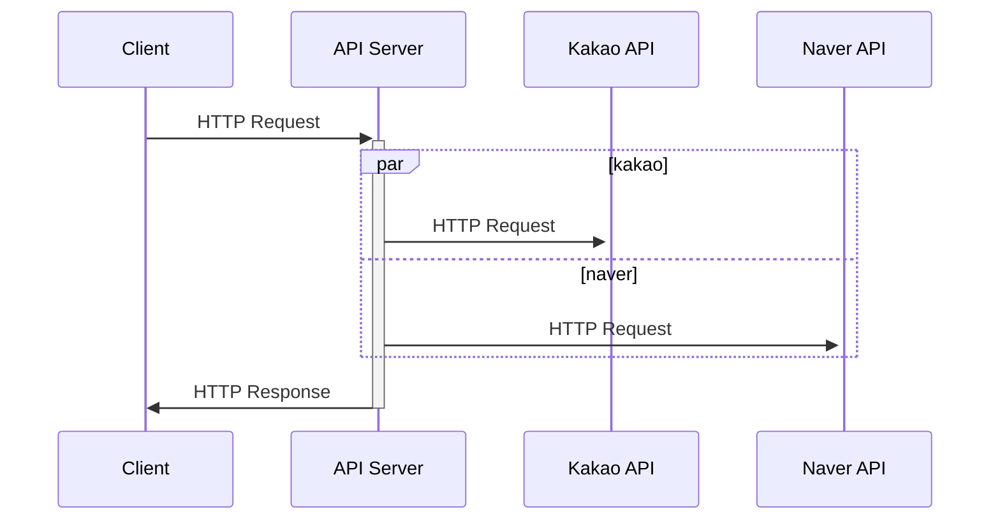

# study-localsearch-api
## 기술

- Java 8
- Spring Boot 2.6.3
- Gradle 7.4
- H2(in-memory) DB


### 사용 라이브러리

- spring-boot-starter-web
- spring-boot-starter-actuator
- spring-boot-devtools
- spring-boot-starter-test
- spring-boot-starter-data-jpa
- spring-boot-starter-webflux
- spring-boot-starter-validation
- spring-boot-starter-aop
- projectlombok
- h2database

---

## API 목록

### 1) 장소 검색

**`GET) /api/v1/places?query={query}`**

#### ==호출 예시==

```sh
$ curl http://localhost:8080/api/v1/places?query=%EA%B0%88%EB%B9%84
```

#### ==Request==

| 메서드 | URL            | 출력             |
| ------ | -------------- | ---------------- |
| GET    | /api/v1/places | application/json |

##### Query Params

| KEY   | DESC                    |
| ----- | ----------------------- |
| query | 검색어 (UTF-8 Encoding) |


#### ==Response==

##### Message

| NAME    | TYPE   | DESC             |
| ------- | ------ | ---------------- |
| code    | String | HTTP 응답 코드   |
| message | String | HTTP 응답 메시지 |
| result  | Object | 응답 결과        |

##### Place

| NAME        | TYPE   | DESC          |
| ----------- | ------ | ------------- |
| name        | String | 장소명        |
| url         | String | 홈페이지 주소 |
| category    | String | 장소 분류     |
| phone       | String | 연락처        |
| address     | String | 동 주소       |
| roadAddress | String | 도로명 주소   |

```json
{
    "code": "200",
    "message": "OK",
    "result": {
        "places": [
            {
                "name": "식당A",
                "url": "http://place.map.kakao.com/1234567",
                "category": "음식점 > 한식 > 소분류",
                "phone": "012-345-6789",
                "address": "강원 공공시 공공동 123",
                "roadAddress": "강원 공공시 공공공마을길 12"
            },
          	...
        ]
    }
}
```


#### ==호출 흐름==




### 2) 검색 키워드 목록

**`GET) /api/v1/trends`**

#### ==호출 예시==

```sh
$ curl http://localhost:8080/api/v1/trends
```

#### ==Request==

| 메서드 | URL            | 출력             |
| ------ | -------------- | ---------------- |
| GET    | /api/v1/trends | application/json |


#### ==Response==

##### Message

| NAME    | TYPE   | DESC             |
| ------- | ------ | ---------------- |
| code    | String | HTTP 응답 코드   |
| message | String | HTTP 응답 메시지 |
| result  | Object | 응답 결과        |

##### Trend

| NAME    | TYPE   | DESC      |
| ------- | ------ | --------- |
| keyword | String | 검색어    |
| count   | Long   | 검색 횟수 |

```json
{
    "code": "200",
    "message": "OK",
    "result": {
        "trends": [
            {
                "keyword": "곱창",
                "count": 10
            },
          	...
        ]
    }
}
```


---

## 기술적 요구사항

### 동시성 이슈가 발생할 수 있는 부분

```java
	@Transactional
	private void updateKeyword(String query) {
		SearchHistoryInfo item = searchHistoryRepository.findOneByKeyword(query);
    ...
		SearchHistoryInfo update = SearchHistoryInfo.builder()
				.keyword(item.getKeyword())
				.count(item.getCount()+1)
				.build();
		update = searchHistoryRepository.save(update);
	}
```

검색 API 호출시 search_history 테이블의 count를 1씩 증가합니다.

**Repository**

```java
@Repository
public interface SearchHistoryRepository extends JpaRepository<SearchHistoryInfo, String> {
	@Lock(value = LockModeType.PESSIMISTIC_WRITE)
	@QueryHints({@QueryHint(name = "javax.persistence.lock.timeout", value ="1000")})
	SearchHistoryInfo findOneByKeyword(String keyword);
  ...
}
```

`	@Lock(value = LockModeType.PESSIMISTIC_WRITE)`

Read 오퍼레이션에 대하여 비관적 락을 명시하여 해당 행에 대하여 배타적으로 락을 걸었습니다.

**동시성 테스트**

```java
	@Test
	public void isConcurrencyTestSuccess() throws InterruptedException {
		CountDownLatch latch = new CountDownLatch(nThreads);
		String query = "test";
		SearchHistoryInfo item = searchHistoryRepository.save(SearchHistoryInfo.builder()
				.keyword(query)
				.count(0L)
				.build());
		
		for(int i=0; i<nThreads; i++) {
			service.execute(() -> {
				item.setCount(item.getCount()+1);
				latch.countDown();
			});
		}
		
		latch.await();
		
		SearchHistoryInfo result = searchHistoryRepository.findOneByKeyword(query);
		log.info("success concurrency threads, count: {}, {}", nThreads, result.getCount());
		
		assertTrue(result.getCount() == nThreads);
	}

@Test
	public void isConcurrencyTestFail() throws InterruptedException {
		CountDownLatch latch = new CountDownLatch(nThreads);
		String query = "test";
		SearchHistoryInfo item = searchHistoryRepository.save(SearchHistoryInfo.builder()
				.keyword(query)
				.count(0L)
				.build());
		
		for(int i=0; i<nThreads; i++) {
			service.execute(() -> {
				item.setCount(item.getCount()+1);
				latch.countDown();
			});
		}
		
		latch.await();
		
		SearchHistoryInfo result = searchHistoryRepository.findOneByKeywordOrderByKeyword(query);
		log.info("fail concurrency threads, count: {}, {}", nThreads, result.getCount());
		
		assertTrue(result.getCount() != nThreads);
	}
```

> nThreads = 2000

**실행 결과**

```java
2022-02-17 22:17:54.802  INFO 3113 --- [           main] c.a.r.SearchHistoryRepositoryTests       : success concurrency threads, count: 2000, 2000
2022-02-17 22:17:54.841  INFO 3113 --- [           main] c.a.r.SearchHistoryRepositoryTests       : fail concurrency threads, count: 2000, 1927
```

